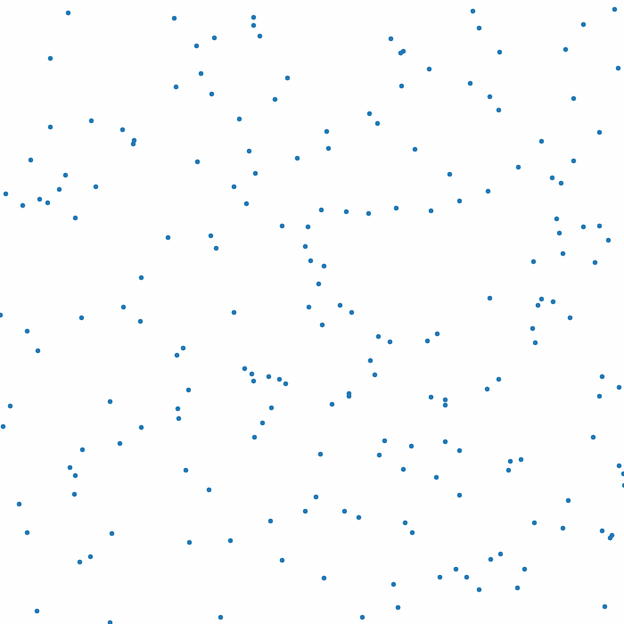

# NumpyBoids
An attempt at boids flocking without iterating over individual boids, but rather by using matrix math.

# Bugs
1. Speed vaiance has an impact on all the other factors due to method of implementation.
   1. This is due to a higher speed reducing the number of times steps that the boids interact with eachother in. This can be fixed by inluding a multiplying the flocking forces by the speed (which is effectively the time step) so they remain relatively constant.

# Improvements
1. Short term
   1. Triangles - Use of triangles rather than points for the boids to show directions better
   1. Colours
      1. Different colours
      2. The likes of boids as point lights, not individually visible but noticeable as groups
   2. Edge avoidance - rather than bouncing off edges, actively steer to avoid them
2. Long term
   1.  Use of pygame (or similar) for graphics
   2. Direction dependent visibility - boids only make decisions based on what is visible in front of them
   3. Trails - For pretty graphics, add some trails for each boid showing location history
   4. 3D - Expand dimensions to 3D. This could be performance dependent
   5. Object avoidance and attraction - Mouse, wall or akin object avoidance and attraction
3. Curiosities
   1. Performance
      1. Compare flocking calculation method with iterative methods
      2. See how much of a bottle neck the use of Matplotlib is in producing graphics

